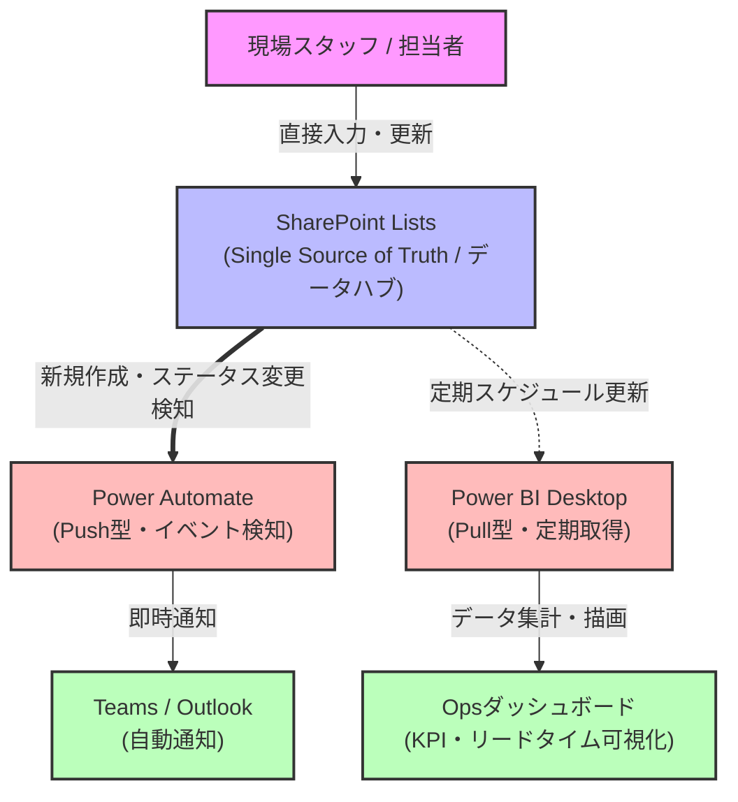

# 現場依頼・Ops管理パイプライン（M365ベースの小規模Opsシステム）

## 📌 概要
ライン部門の現場から発生する各種依頼（備品、システム、人員、顧客対応など）を一元管理し、業務の滞留や処理スピード（リードタイム）をデータで可視化するためのプロトタイプOpsシステムです。

単なる「入力・管理ツール」ではなく、運用の保守性や各コンポーネントの責務分離（疎結合なデータパイプライン）を意識して設計・構築しています。

---

## 🛠️ システム構成・アーキテクチャ
本システムは、UI層・処理層・可視化層の依存関係を排除し、**SharePoint ListsをSingle Source of Truth（SSoT）**とした疎結合な構成を採用しています。

ユーザーの直接入力から通知、定期実行による可視化までの全体のデータフローとコンポーネントの関係性を表しています。

---

## ⚙️ 設計判断と技術選定の経緯

開発の初期段階では、一般的なローコード開発の主流に沿って「Power Apps」をフロントエンドの入力UIおよび処理のハブとして構築・検証を行いました。しかし、実装・検証を進める中で以下の課題に直面しました。

### 1. **Power Appsを中心とした構成での課題**
* アプリ側の書き込み処理でエラーが発生しやすく、**原因の切り替えやデバッグに工数がかかった。**
* UI層に後続処理のトリガーやデータ処理が依存することで、結合度が高くなり変更や障害時の影響範囲が広がった。

### 2. **SharePoint Listsをハブとしたアーキテクチャへのリファクタリング**
* 「実現できるか」だけでなく、**「問題が起きた際に原因を追いやすく、継続的に運用できるか（保守性・デバッグ性）」**を最優先に再設計。
* **SharePoint Listsをデータハブ（SSoT）として配置**し、ユーザーからの登録、Power Automateによる通知、Power BIによる可視化の各責務を完全に分離。

### 3. **通知（Push）と可視化（Pull）の分離**
* 迅速な通知が求められる処理は、SharePointのイベントを起点とする**Push型（Power Automate）**を採用。
* 一方で、ダッシュボードの可視化はリアルタイム同期の必要性が低いため、定期的な**Pull型（Power BI）**を採用し、不要なリアルタイム依存やシステム間の複雑性を排除。

> **学び:** この経験から、ローコード・ノーコード環境であっても、単に「動く構成」ではなく、運用・保守性、障害時の切り分けやすさ、疎結合な依存関係の設計が実務においていかに重要であるかを学びました。

---

## 📊 実装した主要機能と可視化（Power BI）

現場のオペレーション状況を正しく把握し、業務改善につなげるため、以下のデータ設計と可視化を行っています。

* **リードタイム（実作業時間）の自動算出**
  * 単なる「登録から完了まで」ではなく、現場の実態に即した**「対応開始時間」から「完了日時」までの差分**をDAX関数で算出。
  * 未完了案件を `BLANK()` で適切に除外し、小数点単位の時間（Hour）で平均処理時間を集計。
* **Opsダッシュボードの構成**
  * **KPIサマリー:** 未対応件数 / 対応中件数 / 完了件数 / 平均処理時間
  * **ステータス内訳:** 全体に対する進捗の割合（ドーナツグラフ）
  * **担当者別負荷:** 担当ごとの依頼件数・偏りの可視化（横棒グラフ）
  * **日別トレンド:** 依頼件数の推移と滞留リスクの監視

---

## 📸 成果物スクリーンショット

### ① Power BI ダッシュボード（KPI・処理時間・進捗状況）
* **ポイント:** 主要KPI（未対応・対応中・完了・平均処理時間）を最上部に集約し、ステータスや担当者別の負荷が一目で把握できるデザインに設計。

### ② SharePoint Lists（データハブ）

### ③ Power Automate フロー

---

## 🚀 このプロジェクトで得た知見・アピールポイント

* **業務プロセスから逆算したデータ設計:** データの発生から処理、可視化までのパイプラインを一気通貫で構築。
* **失敗を活かしたアーキテクチャの刷新:** ツールの標準機能に盲目的に頼るのではなく、デバッグ性や運用性を考慮してPower Appsを排除し、保守性の高い疎結合システムへリファクタリングしたエンジニアリング思考。
* **実務に直結するOps視点:** 件数管理だけでなく「リードタイム（処理時間）」や「担当者別の偏り」を可視化し、現場のボトルネック改善に寄与する仕組みを構築。
💡 設計判断と技術選定の経緯（Design Decisions）
開発の初期段階では、一般的なローコード開発の主流に沿って「Power Apps」をフロントエンドの入力UIおよび処理のハブとして構築・検証を行いました。しかし、実装・検証を進める中で以下の課題に直面しました。

